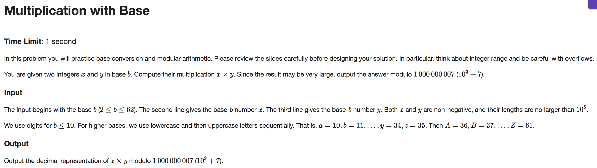

## A


```java
import java.io.BufferedReader;
import java.io.InputStreamReader;
import java.util.ArrayList;
import java.util.Collections;
import java.util.Comparator;

public class Main
{
    private static int bestScore = 0;

    public static void main (String args[]) throws Exception
    {
        String line;
        String[] dimensions;
        int rows, cols;

        BufferedReader br = new BufferedReader(new InputStreamReader(System.in));

        Image[] images = new Image[2];
        for (int i = 0; i < 2; i++) {
            line = br.readLine();
            dimensions = line.split("\\s");
            rows = Integer.parseInt(dimensions[0]);
            cols = Integer.parseInt(dimensions[1]);
            Image img = new Image(rows, cols);
            for (int row = 0; row < rows; row++) {
                line = br.readLine();
                for (int col = 0; col < cols; col++) {
                    char pixel = line.charAt(col);
                    if (pixel == '#') {
                        img.addBlackPixel(new int[] {row, col});
                    }
                }
            }
            images[i] = img;
        }

        Image a = images[0];
        Image b = images[1];

        int max = a.size();
        if (b.size() < max) { max = b.size(); }

        images = new Image[12];
        images[0] = a;
        images[1] = images[0].rotate90();
        images[2] = images[1].rotate90();
        images[3] = images[2].rotate90();
        images[4] = a.flipVertical();
        images[5] = images[4].rotate90();
        images[6] = images[5].rotate90();
        images[7] = images[6].rotate90();
        images[8] = a.flipHorizontal();
        images[9] = images[8].rotate90();
        images[10] = images[9].rotate90();
        images[11] = images[10].rotate90();

        for (Image img : images) {
            int deltaRow = -1 * (img.getRows() - 1);
            for (int i = 1; i < b.getRows() + img.getRows(); i++) {
                int deltaCol = -1 * (img.getCols() - 1);
                for (int j = 1; j < b.getCols() + img.getCols(); j++) {
                    int score = img.translate(deltaRow, deltaCol).similarity(b);
                    checkScore(score, max);
                    deltaCol++;
                }
                deltaRow++;
            }
        }

        System.out.print(bestScore);
    }

    private static void checkScore(int score, int max) {
        if (score == max) {
            System.out.print(score);
            System.exit(0);
        }
        if (score > bestScore) { bestScore = score; }
    }
}

class Image {
    private int rows;
    private int cols;
    private ArrayList<int[]> blackPixels;

    private Comparator<int[]> pixelComparator = new Comparator<int[]>() {
        public int compare(int[] a, int[] b) {
            if (a[0] < b[0] || (a[0] == b[0] && a[1] < b[1])) { return -1; }
            else if (a[0] > b[0] || (a[0] == b[0] && a[1] > b[1])) { return 1; }
            return 0;
        }
    };

    Image(int rows, int cols) {
        this.rows = rows;
        this.cols = cols;
        blackPixels = new ArrayList<int[]>(rows * cols);
    }

    public int getRows() {
        return rows;
    }

    public int getCols() {
        return cols;
    }

    public int size() {
        return blackPixels.size();
    }

    void addBlackPixel(int[] pixel) {
        blackPixels.add(pixel);
    }

    private ArrayList<int[]> getBlackPixels() {
        return blackPixels;
    }

    Image translate(int deltaX, int deltaY) {
        Image img = new Image(rows, cols);
        for (int[] pixel : blackPixels) {
            int row = pixel[0] + deltaX;
            int col = pixel[1] + deltaY;
            img.addBlackPixel(new int[] {row, col});
        }
        return img;
    }

    Image flipHorizontal() {
        Image img = new Image(rows, cols);
        int lastRowIndex = rows - 1;
        for (int[] pixel : blackPixels) {
            int row = Math.abs(pixel[0] - lastRowIndex);
            int col = pixel[1];
            img.addBlackPixel(new int[] {row, col});
        }
        return img;
    }

    Image flipVertical() {
        Image img = new Image(rows, cols);
        int lastColIndex = cols - 1;
        for (int[] pixel : blackPixels) {
            int row = pixel[0];
            int col = Math.abs(pixel[1] - lastColIndex);
            img.addBlackPixel(new int[] {row, col});
        }
        return img;
    }

    Image rotate90() {
        Image img = new Image(cols, rows);
        for (int[] pixel : blackPixels) {
            int row = pixel[1];
            int col = (rows - pixel[0]) - 1;
            img.addBlackPixel(new int[] {row, col});
        }
        return img;
    }

    int similarity(Image other) {
        int score = 0;
        ArrayList<int[]> otherBlackPixels = other.getBlackPixels();
        Collections.sort(blackPixels, pixelComparator);
        for (int[] otherPixel : otherBlackPixels) {
            int match = Collections.binarySearch(blackPixels, otherPixel, pixelComparator);
            if (match >= 0) {
                score++;
            }
        }
        return score;
    }
}

```

---

## B


```java
import java.io.*;
import java.text.*;
import java.util.*;

public class Main {

    public static void main(String[] args) throws IOException, ParseException {
        final int MAGIC = 91;

        BufferedReader br = new BufferedReader(new InputStreamReader(System.in));
        String line;
        String[] tokens;

        line = br.readLine();
        tokens = line.split("\\s");

        int numProblems = Integer.parseInt(tokens[0]);
        int numFreebies = Integer.parseInt(tokens[1]);

        double[] maxPoints = new double[MAGIC];
        double[] minPoints = new double[MAGIC];
        double[] lossPoints = new double[MAGIC];

        for (int i = 0; i < numProblems; i++) {
            line = br.readLine();
            tokens = line.split("\\s");
            int id = tokens[0].charAt(0);
            double points = Double.parseDouble(tokens[1]);
            maxPoints[id] = points;
            minPoints[id] = points * 0.3d;
            lossPoints[id] = points * 0.1d;
        }

        String startDateString = "2018/" + br.readLine();
        DateFormat df = new SimpleDateFormat("yyyy/MM/dd hh:mm:ssaa");
        long startTime = df.parse(startDateString).getTime();
        long endTime = startTime + 604_800_000;

        HashMap<String, Student> map = new HashMap<>(1000);

        while ((line = br.readLine()) != null) {
            tokens = line.split("\\s");
            String submissionDateString = "2018/" + tokens[0] + " " + tokens[1];
            long submissionTime = df.parse(submissionDateString).getTime();

            String name = tokens[2];
            Student student;
            if (!map.containsKey(name)) {
                student = new Student(name);
                map.put(name, student);
            } else {
                student = map.get(name);
            }
            if (submissionTime < endTime || submissionTime == endTime) {
                int problemId = tokens[3].charAt(0);
                char verdict = tokens[4].charAt(0);
                Submission s = new Submission(submissionTime, problemId, verdict);
                student.addSubmission(s);
            }
        }

        for (Student student : map.values()) {
            int[] usedFreebies = new int[MAGIC];
            boolean[] solved = new boolean[MAGIC];
            double[] points = maxPoints.clone();

            while (student.submissions.size() > 0) {
                Submission s = student.submissions.poll();
                int id = s.problemId;
                if (!solved[id]) {
                    if (s.verdict == 'A') {
                        solved[id] = true;
                        student.score += points[id] < minPoints[id] ? minPoints[id] : points[id];
                    } else {
                        usedFreebies[id]++;
                        if (usedFreebies[id] > numFreebies) {
                            points[id] -= lossPoints[id];
                        }
                    }
                }
            }
        }

        Comparator<Student> studentComparator = new Comparator<Student>() {
            public int compare(Student a, Student b) {
                int nameComparison = a.name.compareTo(b.name);
                if (a.score > b.score || (a.score.equals(b.score) && nameComparison < 0)) { return -1; }
                if (a.score < b.score || (a.score.equals(b.score) && nameComparison > 0)) { return 1; }
                return 0;
            }
        };

        List<Student> students = new ArrayList<>(map.values());
        Collections.sort(students, studentComparator);

        StringBuilder out = new StringBuilder();
        for (Student s : students) {
            out.append(s.name).append(" ").append(s.score).append("\n");
        }

        System.out.print(out);
    }
}

class Submission {
    long time;
    int problemId;
    char verdict;

    Submission(long time, int problemId, char verdict) {
        this.time = time;
        this.problemId = problemId;
        this.verdict = verdict;
    }
}

class Student {
    String name;
    Double score;
    PriorityQueue<Submission> submissions;

    Student(String name) {
        Comparator<Submission> submissionComparator = new Comparator<Submission>() {
            public int compare(Submission a, Submission b) {
                return Long.compare(a.time, b.time);
            }
        };

        submissions = new PriorityQueue<>(1000, submissionComparator);
        this.name = name;
        score = 0d;
    }

    void addSubmission(Submission s) {
        submissions.add(s);
    }
}

```

---

## C



```java
import java.io.BufferedReader;
import java.io.InputStreamReader;
import java.io.IOException;

public class Main {

    private static final int P = 1_000_000_007;

    public static void main(String[] args) throws IOException {
        BufferedReader br = new BufferedReader(new InputStreamReader(System.in));

        int base = Integer.parseInt(br.readLine());
        String x = br.readLine();
        String y = br.readLine();

        int size = x.length();
        if (y.length() > x.length()) {
            size = y.length();
        }

        int[] powerCache = new int[size];
        int x10, y10;

        if (x.length() > y.length()) {
            x10 = toBase10(x, base, powerCache);
            y10 = toBase10(y, base, powerCache);
        } else {
            y10 = toBase10(y, base, powerCache);
            x10 = toBase10(x, base, powerCache);
        }

        long temp = x10 % P;
        temp = (temp * y10) % P;
        int out = (int)temp;

        System.out.print(out);
    }

    private static int toBase10(String vector, int base, int[] powerCache) {
        int decimal = 0;
        int power = 0;
        for (int i = vector.length() - 1; i >= 0; i--) {
            char nextChar = vector.charAt(i);

            int a = toInt(nextChar);

            long temp;
            int b = 1;
            if (powerCache[power] != 0) {
                b = powerCache[power];
            } else {
                if (power > 0) {
                    temp = powerCache[power - 1] % P;
                    temp = (temp * base) % P;
                    b = (int)temp;
                }
                powerCache[power] = b;
            }

            temp = a % P;
            temp = (temp * b) % P;
            int weight = (int)temp;
            temp = decimal % P;
            temp = (temp + weight) % P;
            decimal = (int)temp;

            power++;
        }

        return decimal;
    }

    private static int toInt(char a) {
        if (a >= 97) { // a - z
            return a - 87;
        } else if (a >= 65) { // A - Z
            return a - 29;
        }
        return a - 48; // 0 - 9
    }
}

```
