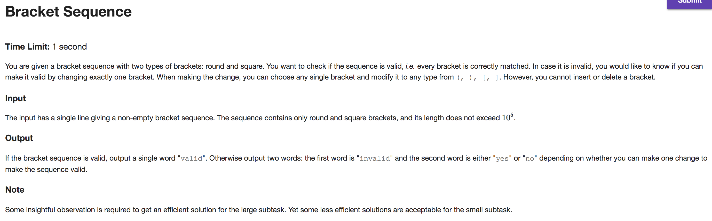

## A


```java
import java.io.BufferedReader;
import java.io.IOException;
import java.io.InputStreamReader;
import java.util.HashMap;

public class Main {

    public static void main(String[] args) throws IOException {
        BufferedReader br = new BufferedReader(new InputStreamReader(System.in));

        br.readLine(); // skip this line
        String[] names = br.readLine().split("\\s");
        int q = Integer.parseInt(br.readLine());

        HashMap<String,Student> map = new HashMap<>(100000);

        for (int i = 0; i < names.length; i++) {
            String name = names[i];
            Student curStudent = new Student(name);
            map.put(name, curStudent);
            if (i - 1 >= 0) {
                Student leftStudent = map.get(names[i - 1]);
                curStudent.left = leftStudent.name;
                leftStudent.right = curStudent.name;
            }
        }

        StringBuilder out = new StringBuilder();
        for (int i = 0; i < q; i++) {
            String[] tokens = br.readLine().split("\\s");
            String command = tokens[0];

            switch (command) {
                case "e":
                    String studentName = tokens[1];
                    Student exitStudent = map.get(studentName);
                    String leftName = exitStudent.left;
                    String rightName = exitStudent.right;
                    Student leftStudent = leftName != null ? map.get(leftName) : null;
                    Student rightStudent = rightName != null ? map.get(rightName) : null;
                    if (leftStudent != null) {
                        leftStudent.right = rightStudent != null ? rightStudent.name : null;
                    }
                    if (rightStudent != null) {
                        rightStudent.left = leftStudent != null ? leftStudent.name : null;
                    }
                    break;
                case "x":
                    String studentNameOne = tokens[1];
                    String studentNameTwo = tokens[2];
                    Student studentOne = map.get(studentNameOne);
                    Student studentTwo = map.get(studentNameTwo);
                    String studentOneLeftName = studentOne.left;
                    String studentOneRightName = studentOne.right;
                    String studentTwoLeftName = studentTwo.left;
                    String studentTwoRightName = studentTwo.right;
                    Student studentOneLeftStudent = studentOneLeftName != null ? map.get(studentOneLeftName) : null;
                    Student studentOneRightStudent = studentOneRightName != null ? map.get(studentOneRightName) : null;
                    Student studentTwoLeftStudent = studentTwoLeftName != null ? map.get(studentTwoLeftName) : null;
                    Student studentTwoRightStudent = studentTwoRightName != null ? map.get(studentTwoRightName) : null;

                    if (studentOne.right != null && studentOne.right.equals(studentTwo.name)) {
                        studentOne.left = studentTwo.name;
                        studentTwo.right = studentOne.name;
                        studentOne.right = studentTwoRightName;
                        studentTwo.left = studentOneLeftName;
                        if (studentOneLeftStudent != null) {
                            studentOneLeftStudent.right = studentTwo.name;
                        }
                        if (studentTwoRightStudent != null) {
                            studentTwoRightStudent.left = studentOne.name;
                        }
                    } else if (studentOne.left != null && studentOne.left.equals(studentTwo.name)) {
                        studentOne.right = studentTwo.name;
                        studentTwo.left = studentOne.name;
                        studentOne.left = studentTwoLeftName;
                        studentTwo.right = studentOneRightName;
                        if (studentOneRightStudent != null) {
                            studentOneRightStudent.left = studentTwo.name;
                        }
                        if (studentTwoLeftStudent != null) {
                            studentTwoLeftStudent.right = studentOne.name;
                        }
                    } else {
                        studentOne.right = studentTwoRightName;
                        studentOne.left = studentTwoLeftName;
                        studentTwo.right = studentOneRightName;
                        studentTwo.left = studentOneLeftName;

                        if (studentOneLeftStudent != null) {
                            studentOneLeftStudent.right = studentTwo.name;
                        }
                        if (studentOneRightStudent != null) {
                            studentOneRightStudent.left = studentTwo.name;
                        }
                        if (studentTwoLeftStudent != null) {
                            studentTwoLeftStudent.right = studentOne.name;
                        }
                        if (studentTwoRightStudent != null) {
                            studentTwoRightStudent.left = studentOne.name;
                        }
                    }
                    break;
                case "l":
                    String lQueryName = tokens[1];
                    Student lQueryStudent = map.get(lQueryName);
                    String leftQueryName = lQueryStudent.left != null ? lQueryStudent.left : "-1";
                    out.append(leftQueryName).append("\n");
                    break;
                case "r":
                    String rQueryName = tokens[1];
                    Student rQueryStudent = map.get(rQueryName);
                    String rightQueryName = rQueryStudent.right != null ? rQueryStudent.right : "-1";
                    out.append(rightQueryName).append("\n");
                    break;
            }
        }

        System.out.print(out);
    }
}

class Student {
    String name;
    String left;
    String right;

    Student(String name) {
        this.name = name;
        this.left = null;
        this.right = null;
    }
}


```

---

## B



```java
import java.io.BufferedReader;
import java.io.IOException;
import java.io.InputStreamReader;
import java.util.Stack;

public class Main {

    public static void main(String[] args) throws IOException {
        BufferedReader br = new BufferedReader(new InputStreamReader(System.in));
        String line = br.readLine();

        Stack<Bracket> stack = new Stack<Bracket>();
        boolean valid = true;
        int badIndexOne = -1;
        int badIndexTwo = -1;

        for (int index = 0; index < line.length(); index++) {
            char token = line.charAt(index);
            Bracket b = new Bracket(token, index);

            if (token == '(' || token == '[') {
                stack.push(b);
            } else {
                if (stack.size() > 0) {
                    Bracket top = stack.peek();
                    if ((top.token == '(' && b.token == ')') || (top.token == '[' && b.token == ']')) {
                        stack.pop();
                    } else {
                        valid = false;
                        badIndexOne = b.index;
                        badIndexTwo = top.index;
                        break;
                    }
                } else {
                    valid = false;
                    badIndexOne = b.index;
                    break;
                }
            }
        }

        if (!valid) {
            if (fixable(line, badIndexOne) || (badIndexTwo != -1 && fixable(line, badIndexTwo))) {
                System.out.print("invalid yes");
            } else {
                System.out.print("invalid no");
            }
        } else if (stack.size() == 2) {
            int badIndex = stack.peek().index;
            if (fixable(line, badIndex)) {
                System.out.print("invalid yes");
            } else {
                System.out.print("invalid no");
            }
        } else if (stack.size() != 0) {
            System.out.print("invalid no");
        } else {
            System.out.print("valid");
        }
    }

    private static boolean fixable(String line, int index) {
        return isValid(line, "(", index) || isValid(line, "[", index) ||
                isValid(line, ")", index) || isValid(line, "]", index);
    }

    private static boolean isValid(String line, String token, int index) {
        Stack<String> stack = new Stack<String>();
        for (int i = 0; i < line.length(); i++) {
            String next = i == index ? token : String.valueOf(line.charAt(i));
            if (next.equals("(") || next.equals("[")) {
                stack.push(next);
            } else {
                if (stack.size() > 0) {
                    String top = stack.peek();
                    if ((top.equals("(") && next.equals(")")) || (top.equals("[") && next.equals("]"))) {
                        stack.pop();
                    } else {
                        return false;
                    }
                } else {
                    return false;
                }
            }
        }

        return stack.size() == 0;
    }
}

class Bracket {
    char token;
    int index;

    Bracket(char token, int index) {
        this.token = token;
        this.index = index;
    }
}
```

---

## C


```java
import java.io.BufferedReader;
import java.io.IOException;
import java.io.InputStreamReader;
import java.util.ArrayList;
import java.util.Stack;

public class Main {

    public static void main(String[] args) throws IOException {
	    final int P = 1_000_000_007;

        BufferedReader br = new BufferedReader(new InputStreamReader(System.in));
        String infixExpression = br.readLine();

        if (infixExpression.contains("()")) {
            System.out.print("invalid"); System.exit(0);
        }

        ArrayList<String> postFixExpression = new ArrayList<>();
        Stack<String> stack = new Stack<>();
        int operands = 0;
        int operators = 0;
        boolean lastWasOperand = false;

        for (int i = 0; i < infixExpression.length(); i++) {
            char token = infixExpression.charAt(i);
            if (Character.isDigit(token)) {
                if (lastWasOperand) {
                    System.out.print("invalid"); System.exit(0);
                }
                lastWasOperand = true;
                StringBuilder operand = new StringBuilder();
                while (Character.isDigit(token)) {
                    operand.append(token);
                    i++;
                    if (i == infixExpression.length()) { break; }
                    token = infixExpression.charAt(i);
                }
                if (!Character.isDigit(token)) { i--; }
                postFixExpression.add(operand.toString());
                operands++;
            } else if (token == '(') {
                stack.push(String.valueOf(token));
            } else if (token == ')') {
                while (stack.size() > 0 && !stack.peek().equals("(")) {
                    postFixExpression.add(stack.pop());
                }
                if (stack.size() == 0) {
                    System.out.print("invalid"); System.exit(0);
                } else {
                    stack.pop();
                }
            } else { // operator
                lastWasOperand = false;
                String op = String.valueOf(token);
                while (stack.size() > 0 &&
                        !stack.peek().equals("(") &&
                        notLowerPriority(stack.peek(), op)) {
                    postFixExpression.add(stack.pop());
                }
                stack.push(op);
                operators++;
            }
        }

        if (operands - operators != 1) {
            System.out.print("invalid"); System.exit(0);
        }

        while (stack.size() > 0) {
            if (stack.peek().equals("(")) {
                System.out.print("invalid"); System.exit(0);
            }
            postFixExpression.add(stack.pop());
        }

        if (postFixExpression.size() == 0) {
            System.out.print("invalid"); System.exit(0);
        }

//        System.out.println();
//        for (String s : postFixExpression) {
//            System.out.print(s + " ");
//        }

        Stack<Integer> evalStack = new Stack<>();
        for (String s : postFixExpression) {
            if (s.equals("+") || s.equals("-") || s.equals("*")) {
                if (evalStack.size() >= 2) {
                    int b = evalStack.pop();
                    int a = evalStack.pop();
                    long temp = a % P;
                    switch (s) {
                        case "+":
                            temp = (temp + b) % P;
                            evalStack.push((int)temp);
                            break;
                        case "*":
                            temp = (temp * b) % P;
                            evalStack.push((int)temp);
                            break;
                        case "-":
                            if (temp < b) {
                                temp = (P + temp - b) % P;
                                evalStack.push((int)temp);
                            } else {
                                temp = (temp - b) % P;
                                evalStack.push((int)temp);
                            }
                            break;
                        default:
                            System.out.println("OH NOOOO:" + s);
                            System.exit(0);
                    }
                } else {
                    System.out.print("invalid"); System.exit(0);
                }
            } else {
                evalStack.push(Integer.parseInt(s));
            }
        }

        System.out.print(evalStack.pop());
    }

    private static boolean notLowerPriority(String a, String b) {
        switch (a) {
            case "+":
                return !b.equals("*");
            case "-":
                return !b.equals("*");
            default: // "-"
                return true;
        }
    }
}


```
