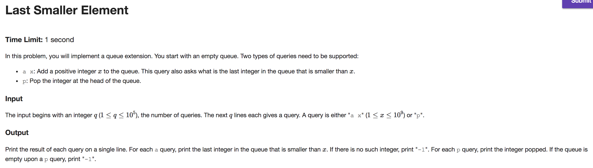
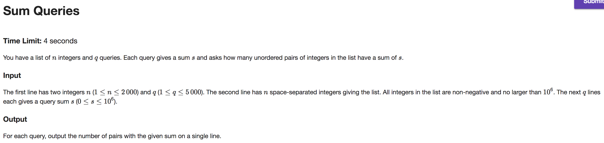
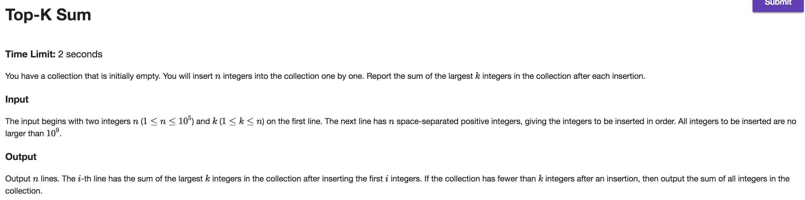
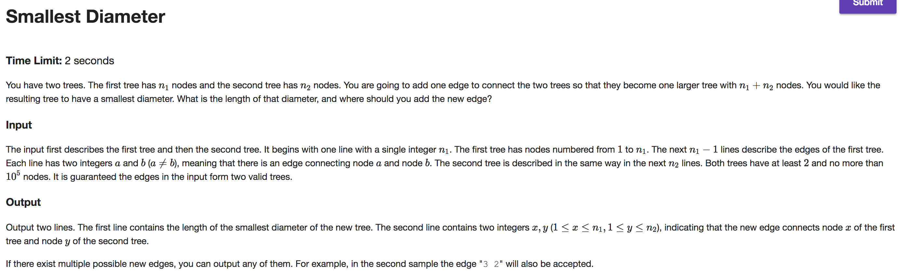

## A



```java
import java.io.BufferedReader;
import java.io.IOException;
import java.io.InputStreamReader;

public class Main {

    public static void main(String[] args) throws IOException {
        BufferedReader br = new BufferedReader(new InputStreamReader(System.in));
        StringBuilder out = new StringBuilder();

        int queries = Integer.parseInt(br.readLine());
        int[][] queue = new int[queries + 1][2]; // {value, indexOfNextSmallest}
        int val = 0, small = 1, tail = 0, head = 1;

        while (queries-- > 0) {
            String[] tokens = br.readLine().split("\\s");
            if (tokens.length == 2) { // enqueue
                int x = Integer.parseInt(tokens[1]);
                int pointer = tail;
                while (true) {
                    int[] datum = queue[pointer];
                    boolean foundNextSmallest = (tail >= head && datum[val] < x);
                    boolean noNextSmallest = !foundNextSmallest && datum[small] < head;
                    if (foundNextSmallest) {
                        queue[++tail] = new int[] {x, pointer};
                        out.append(datum[val]).append("\n");
                        break;
                    } else if (noNextSmallest) {
                        queue[++tail] = new int[] {x, -1};
                        out.append("-1").append("\n");
                        break;
                    } else
                        pointer = datum[small];
                }
            } else { // dequeue
                if (tail - head >= 0) {
                    out.append(queue[head][val]).append("\n"); head++;
                } else
                    out.append("-1").append("\n");
            }
        }
        System.out.print(out);
    }
}

```

---

## B



```java
import java.io.BufferedReader;
import java.io.IOException;
import java.io.InputStreamReader;

public class Main {

    public static void main(String[] args) throws IOException {
        BufferedReader br = new BufferedReader(new InputStreamReader(System.in));
        StringBuilder out = new StringBuilder();

        String[] tokens = br.readLine().split("\\s");

        int n = Integer.parseInt(tokens[0]);
        int q = Integer.parseInt(tokens[1]);

        int[] instances = new int[1_000_000 + 1];
        int[] numbers = new int[n];

        tokens = br.readLine().split("\\s");

        int i = 0;
        for (String token : tokens) {
            int index = Integer.parseInt(token);
            instances[index]++;
            numbers[i++] = index;
        }

        while(q-- > 0) {
            int s = Integer.parseInt(br.readLine());

            int pairs = 0;
            for (int number : numbers) {
                int c = s - number;
                if (c > number) {
                    pairs += instances[c];
                }
            }

            if (s % 2 == 0) {
                int c = s / 2;
                pairs += instances[c] > 1 ? (instances[c] * (instances[c] - 1)) / 2 : 0;
            }

            out.append(pairs).append("\n");
        }

        System.out.print(out);
    }
}

```

---

## C



```java
import java.io.BufferedReader;
import java.io.IOException;
import java.io.InputStreamReader;
import java.math.BigInteger;
import java.util.PriorityQueue;

public class Main {

    public static void main(String[] args) throws IOException {
        BufferedReader br = new BufferedReader(new InputStreamReader(System.in));
        StringBuilder out = new StringBuilder();

        String[] tokens = br.readLine().split("\\s");

        int k = Integer.parseInt(tokens[1]);

        PriorityQueue<Integer> minHeap = new PriorityQueue<Integer>(k);

        tokens = br.readLine().split("\\s");

        BigInteger sum = BigInteger.ZERO;
        for (String token : tokens) {
            int x = Integer.parseInt(token);

            if (minHeap.size() < k) {
                sum = sum.add(BigInteger.valueOf(x));
                minHeap.add(x);
            } else if (x > minHeap.peek()) {
                sum = sum.add(BigInteger.valueOf(x - minHeap.poll()));
                minHeap.add(x);
            }

            out.append(sum).append("\n");
        }

        System.out.print(out);
    }
}

```

---

## D



```java
import java.io.BufferedReader;
import java.io.IOException;
import java.io.InputStreamReader;
import java.util.ArrayList;
import java.util.LinkedList;

public class Main {

    public static void main(String[] args) throws IOException {
        BufferedReader br = new BufferedReader(new InputStreamReader(System.in));

        Node[] roots = new Node[2];
        for (int i = 0; i < roots.length; i++) {
            int n = Integer.parseInt(br.readLine());
            Node[] nodes = new Node[n + 1];
            while (--n > 0) {
                String[] tokens = br.readLine().split("\\s");
                int n1 = Integer.parseInt(tokens[0]);
                int n2 = Integer.parseInt(tokens[1]);
                nodes[n1] = nodes[n1] == null ? new Node(n1) : nodes[n1];
                nodes[n2] = nodes[n2] == null ? new Node(n2) : nodes[n2];
                nodes[n1].neighbors.add(nodes[n2]);
                nodes[n2].neighbors.add(nodes[n1]);
            }
            roots[i] = nodes[1];
        }

        Node lastNode1 = findFarthestNodeFrom(findFarthestNodeFrom(roots[0]));
        Node lastNode2 = findFarthestNodeFrom(findFarthestNodeFrom(roots[1]));
        Node midNode1 = findMidNodeFrom(lastNode1);
        Node midNode2 = findMidNodeFrom(lastNode2);

        int a = lastNode1.meta - (lastNode1.meta / 2);
        int b = lastNode2.meta - (lastNode2.meta / 2);
        int diameter = a + b + 1;
        diameter = diameter > lastNode1.meta ? diameter : lastNode1.meta;
        diameter = diameter > lastNode2.meta ? diameter : lastNode2.meta;

        System.out.println(diameter);
        System.out.println(midNode1.id + " " + midNode2.id);
    }

    private static Node findMidNodeFrom(Node n) {
        int halfDiameter = n.meta / 2;
        while (halfDiameter-- > 0) {
            n = n.pathNode;
        }
        return n;
    }

    private static Node findFarthestNodeFrom(Node n) {
        boolean flagsAreUp = n.flag;
        Node farthestNode = n;
        n.meta = 0;
        n.pathNode = null;
        LinkedList<Node> queue = new LinkedList<Node>();
        while (n != null) {
            n.flag = !flagsAreUp;
            farthestNode = n.meta > farthestNode.meta ? n : farthestNode;
            for (Node c : n.neighbors) {
                if (flagsAreUp == c.flag) {
                    c.meta = 1 + n.meta;
                    c.pathNode = n;
                    queue.add(c);
                }
            }
            n = queue.poll();
        }
        return farthestNode;
    }
}

class Node {
    int id;
    int meta;
    boolean flag;
    Node pathNode;
    ArrayList<Node> neighbors;

    Node(int id) {
        this.id = id;
        neighbors = new ArrayList<Node>();
    }
}

```
