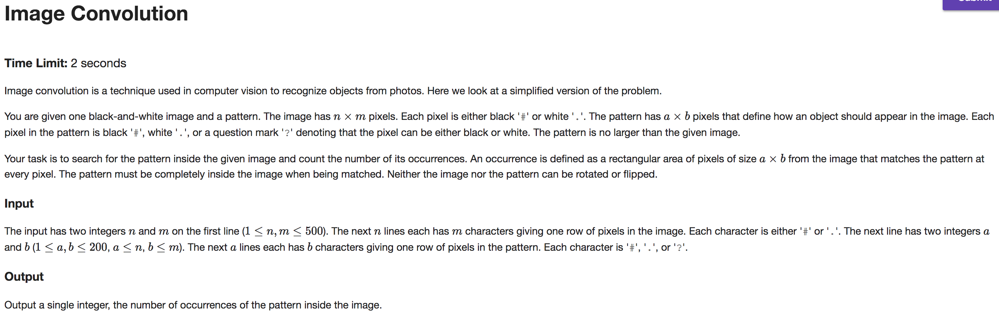
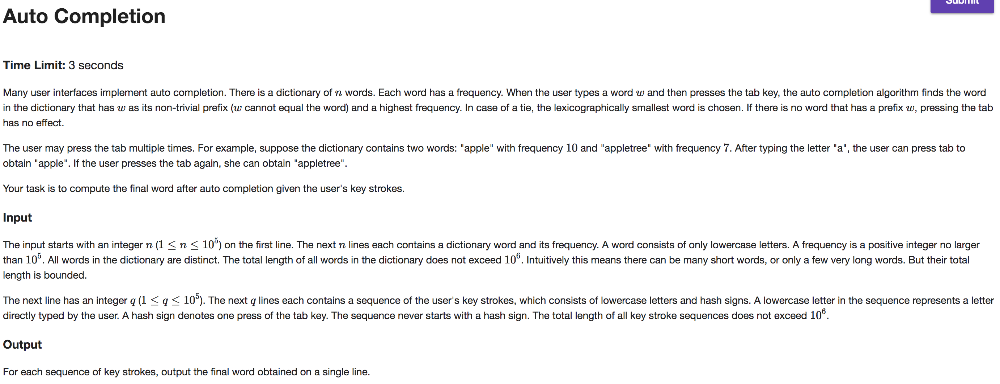
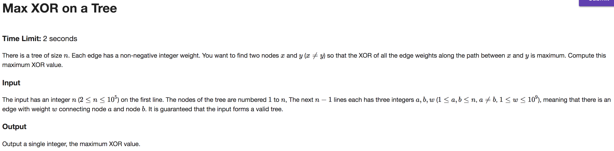

## A



```java
import java.io.BufferedReader;
import java.io.IOException;
import java.io.InputStreamReader;
import java.util.BitSet;

public class Main {

    public static void main(String[] args) throws IOException {
        BufferedReader br = new BufferedReader(new InputStreamReader(System.in));

        String[] tokens = br.readLine().split("\\s");
        int iRow = Integer.parseInt(tokens[0]);
        int iCols = Integer.parseInt(tokens[1]);
        BitSet[] iBitSets = new BitSet[iRow];
        for (int i = 0; i < iRow; i++) {
            String line = br.readLine();
            iBitSets[i] = new BitSet(iCols);
            for (int j = 0; j < iCols; j++) {
                if (line.charAt(j) == '#') {
                    iBitSets[i].set(j);
                }
            }
        }
        tokens = br.readLine().split("\\s");
        int pRows = Integer.parseInt(tokens[0]);
        int pCols = Integer.parseInt(tokens[1]);
        BitSet[] pBitSets = new BitSet[pRows];
        BitSet[] nBitSets = new BitSet[pRows];
        for (int i = 0; i < pRows; i++) {
            String line = br.readLine();
            pBitSets[i] = new BitSet(pCols);
            nBitSets[i] = new BitSet(pCols);
            for (int j = 0; j < pCols; j++) {
                nBitSets[i].set(j);
                if (line.charAt(j) == '#') {
                    pBitSets[i].set(j);
                }
                if (line.charAt(j) == '?') {
                    nBitSets[i].set(j, false);
                }
            }
        }

        int matches = 0;
        int rowShifts = iRow - pRows;
        int colShifts = iCols - pCols;

        for (int i = 0; i <= rowShifts; i++) {
            for (int j = 0; j <= colShifts; j++) {
                boolean match = true;
                for (int pRow = 0; pRow < pRows; pRow++) {
                    BitSet iSet = iBitSets[pRow + i].get(j, pCols + j);
                    iSet.xor(pBitSets[pRow]);
                    iSet.and(nBitSets[pRow]);
                    if (!iSet.isEmpty()) {
                        match = false;
                        break;
                    }
                }
                if (match)
                    matches++;
            }
        }

        System.out.print(matches);
    }
}

```

---

## B



```java
import java.io.BufferedReader;
import java.io.IOException;
import java.io.InputStreamReader;
import java.util.HashMap;

public class Main {

    public static void main(String[] args) throws IOException {
        BufferedReader br = new BufferedReader(new InputStreamReader(System.in));
        int n = Integer.parseInt(br.readLine());

        Node trie = new Node('-');

        while (n-- > 0) {
            String[] tokens = br.readLine().split("\\s");
            String word = tokens[0];
            int freq = Integer.parseInt(tokens[1]);
            Node node = trie;
            for (int i = 0; i < word.length(); i++) {
                char val = word.charAt(i);
                if (node.children.containsKey(val)) {
                    Node nextNode = node.children.get(val);
                    if (i == word.length() - 1) {
                        nextNode.isWord = true;
                        nextNode.wordFreq = freq;
                    }
                    if (freq > nextNode.pathFreq) {
                        nextNode.pathFreq = freq;
                        if (nextNode.moreFrequentThan(node.hfChild))
                            node.hfChild = nextNode;
                    }
                    node = nextNode;
                } else {
                    Node nextNode = new Node(val);
                    nextNode.pathFreq = freq;
                    if (i == word.length() - 1) {
                        nextNode.isWord = true;
                        nextNode.wordFreq = freq;
                    }
                    if (node.hfChild == null || nextNode.moreFrequentThan(node.hfChild))
                        node.hfChild = nextNode;
                    node.children.put(val, nextNode);
                    node = nextNode;
                }
            }
        }

        StringBuilder out = new StringBuilder();
        int q = Integer.parseInt(br.readLine());
        while (q-- > 0) {
            Node node = trie;
            boolean broken = false;
            String strokes = br.readLine();
            for (int i = 0; i < strokes.length(); i++) {
                char stroke = strokes.charAt(i);
                if (stroke == '#' && !broken) {
                    while (node.hfChild != null) {
                        node = node.hfChild;
                        out.append(node.val);
                        if (node.isWord && node.wordFreq >= node.pathFreq)
                            break;
                    }
                } else if (stroke != '#') {
                    if (node.children.containsKey(stroke))
                        node = node.children.get(stroke);
                    else
                        broken = true;
                    out.append(stroke);
                }
            }
            out.append("\n");
        }

        System.out.print(out);
    }
}

class Node {
    char val;
    boolean isWord;
    HashMap<Character, Node> children;

    int wordFreq;
    int pathFreq;
    Node hfChild;

    Node(char val) {
        this.val = val;
        children = new HashMap<Character, Node>();
    }

    boolean moreFrequentThan(Node n) {
        boolean higherFreq = pathFreq > n.pathFreq;
        boolean smallLex = pathFreq == n.pathFreq && val < n.val;
        return higherFreq || smallLex;
    }
}

```

---

## C



```java
import java.io.BufferedReader;
import java.io.IOException;
import java.io.InputStreamReader;
import java.util.ArrayList;
import java.util.LinkedList;

public class Main {

    public static void main(String[] args) throws IOException {
        BufferedReader br = new BufferedReader(new InputStreamReader(System.in));
        int n = Integer.parseInt(br.readLine()); int edges = n - 1;
        Node[] nodes = new Node[n + 1]; // neglect index 0
        while (edges-- > 0) {
            String[] tokens = br.readLine().split("\\s");
            int a = Integer.parseInt(tokens[0]);
            int b = Integer.parseInt(tokens[1]);
            int w = Integer.parseInt(tokens[2]);
            nodes[a] = nodes[a] == null ? new Node(a) : nodes[a];
            nodes[b] = nodes[b] == null ? new Node(b) : nodes[b];
            nodes[a].edges.add(new Edge(b, w));
            nodes[b].edges.add(new Edge(a, w));
        }

        int res = 0;
        Trie trie = new Trie(); trie.insert(0);
        Node node = nodes[1]; // arbitrary root
        LinkedList<Node> queue = new LinkedList<>();
        boolean[] visited = new boolean[n + 1]; // neglect index 0
        while (node != null) {
            visited[node.id] = true;
            for (Edge edge : node.edges) {
                if (!visited[edge.n]) {
                    Node childNode = nodes[edge.n];
                    childNode.xor = node.id == 1 ? edge.w : edge.w ^ node.xor;
                    res = Math.max(res, trie.queryMaxXor(childNode.xor));
                    trie.insert(childNode.xor);
                    queue.add(childNode);
                }
            }
            node = queue.poll();
        }

        System.out.println(res);
    }
}

class Trie {
    private class TrieNode {
        TrieNode on;
        TrieNode off;
        TrieNode() {}
    }

    private TrieNode root;

    Trie() {
        root = new TrieNode();
    }

    void insert(int bits) {
        TrieNode node = root;
        for (int i = 29; i >= 0; i--) {
            boolean on = ((bits >> i) & 1) == 1;
            if (on && node.on == null)
                node.on = new TrieNode();
            if (!on && node.off == null)
                node.off = new TrieNode();
            node = on ? node.on : node.off;
        }
    }

    int queryMaxXor(int bits) {
        TrieNode node = root;
        int comp = 0;
        for (int i = 29; i >= 0; i--) {
            boolean on = ((bits >> i) & 1) == 1;
            boolean shouldOn = (on && node.off == null) || (!on && node.on != null);
            if (shouldOn) {
                node = node.on;
                comp = comp | (1 << i);
            } else
                node = node.off;
        }
        return comp ^ bits;
    }
}

class Node {
    int id;
    int xor;
    ArrayList<Edge> edges;
    Node(int id) {
        this.id = id;
        edges = new ArrayList<>();
    }
}

class Edge {
    int n;
    int w;
    Edge(int n, int w) {
        this.n = n;
        this.w = w;
    }
}

```
