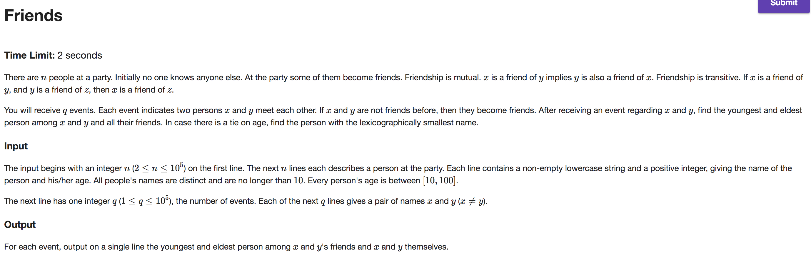
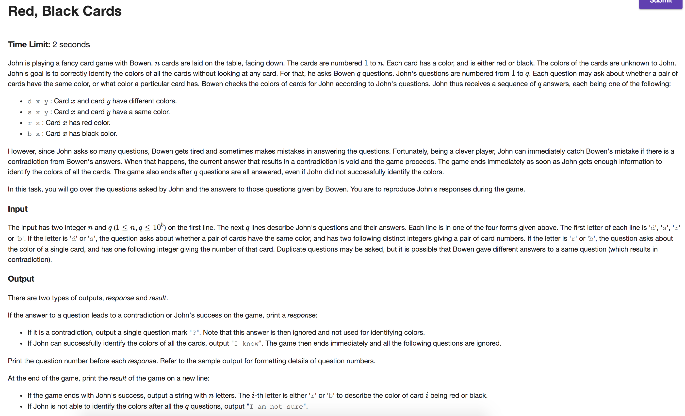
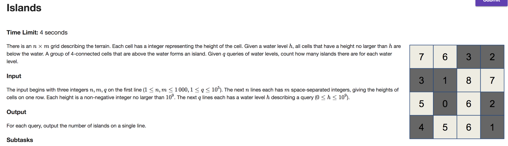

## A



```java
import java.io.BufferedReader;
import java.io.IOException;
import java.io.InputStreamReader;
import java.util.HashMap;

public class Main {

    public static void main(String[] args) throws IOException {
        BufferedReader br = new BufferedReader(new InputStreamReader(System.in));
        StringBuilder out = new StringBuilder();

        Integer n = Integer.parseInt(br.readLine());
        HashMap<String, Person> map = new HashMap<String, Person>(n);
        while (n-- > 0) {
            String[] data = br.readLine().split("\\s");
            String name = data[0]; int age = Integer.parseInt(data[1]);
            map.put(name, new Person(name, age));
        }

        Integer q = Integer.parseInt(br.readLine());
        while (q-- > 0) {
            String[] names = br.readLine().split("\\s");
            Person p1 = map.get(names[0]); Person p2 = map.get(names[1]);
            union(p1, p2); Person r = findRoot(p1);
            out.append(r.youngest.name).append(" ").append(r.oldest.name).append("\n");
        }

        System.out.print(out);
    }

    private static Person findRoot(Person p) {
        if (p.parent == p) return p;
        return p.parent = findRoot(p.parent);
    }

    private static void updateYoungest(Person p1, Person p2) {
        if (p1.youngest.age < p2.youngest.age)
            p2.youngest = p1.youngest;
        else if (p2.youngest.age < p1.youngest.age)
            p1.youngest = p2.youngest;
        else {
            int c = p1.youngest.name.compareTo(p2.youngest.name);
            if (c < 0)
                p2.youngest = p1.youngest;
            else if (c > 0)
                p1.youngest = p2.youngest;
        }
    }

    private static void updateOldest(Person p1, Person p2) {
        if (p1.oldest.age > p2.oldest.age)
            p2.oldest = p1.oldest;
        else if (p2.oldest.age > p1.oldest.age)
            p1.oldest = p2.oldest;
        else {
            int c = p1.oldest.name.compareTo(p2.oldest.name);
            if (c < 0)
                p2.oldest = p1.oldest;
            else if (c > 0)
                p1.oldest = p2.oldest;
        }
    }

    private static void union(Person p1, Person p2) {
        Person r1 = findRoot(p1); Person r2 = findRoot(p2);
        updateYoungest(r1, r2);
        updateOldest(r1, r2);
        if (r1.rank > r2.rank)
            r2.parent = r1;
        else if (r2.rank > r1.rank)
            r1.parent = r2;
        else {
            r2.parent = r1; r1.rank++;
        }
    }
}

class Person {
    String name;
    int age, rank;
    Person parent, youngest, oldest;

    Person(String name, int age) {
        this.name = name;
        this.age = age;
        rank = 0;
        parent = this;
        youngest = this;
        oldest = this;
    }
}

```

---

## B



```java
import java.io.BufferedReader;
import java.io.IOException;
import java.io.InputStreamReader;

public class Main {

    public static void main(String[] args) throws IOException {
        BufferedReader br = new BufferedReader(new InputStreamReader(System.in));
        String[] tokens = br.readLine().split("\\s");
        int n = Integer.parseInt(tokens[0]); int q = Integer.parseInt(tokens[1]);
        Card[] dCards = new Card[n + 1]; // neglect index 0
        Card[] sCards = new Card[n + 1]; // neglect index 0
        for (int i = 1; i <= n; i++) {
            dCards[i] = new Card();
            sCards[i] = new Card();
        }

        int next = 1; String[] colors = new String[n + 1];
        StringBuilder out = new StringBuilder(); boolean badGroup, hasColor, badColor;
        boolean done = false;
        for (int qNum = 1; qNum <= q; qNum++) {
            tokens = br.readLine().split("\\s");
            String type = tokens[0]; int a, b;
            switch (type) {
                case "s":
                    a = Integer.parseInt(tokens[1]); b = Integer.parseInt(tokens[2]);
                    badGroup = findRoot(sCards[a]) == findRoot(dCards[b]);
                    hasColor = !findRoot(sCards[a]).color.equals("?");
                    badColor = hasColor && findRoot(sCards[a]).color.equals(findRoot(dCards[b]).color);
                    if (badGroup || badColor)
                        out.append("Q").append(qNum).append(":").append(" ?\n");
                    else {
                        union(sCards[a], sCards[b]);
                        union(dCards[a], dCards[b]);
                    }
                    break;
                case "d":
                    a = Integer.parseInt(tokens[1]); b = Integer.parseInt(tokens[2]);
                    badGroup = findRoot(sCards[a]) == findRoot(sCards[b]);
                    hasColor = !findRoot(sCards[a]).color.equals("?");
                    badColor = hasColor && findRoot(sCards[a]).color.equals(findRoot(sCards[b]).color);
                    if (badGroup || badColor)
                        out.append("Q").append(qNum).append(":").append(" ?\n");
                    else {
                        union(sCards[a], dCards[b]);
                        union(dCards[a], sCards[b]);
                    }
                    break;
                case "r":
                    a = Integer.parseInt(tokens[1]);
                    if (findRoot(sCards[a]).color.equals("b") || findRoot(dCards[a]).color.equals("r"))
                        out.append("Q").append(qNum).append(":").append(" ?\n");
                    else {
                        findRoot(sCards[a]).color = "r";
                        findRoot(dCards[a]).color = "b";
                    }
                    break;
                case "b":
                    a = Integer.parseInt(tokens[1]);
                    if (findRoot(sCards[a]).color.equals("r") || findRoot(dCards[a]).color.equals("b"))
                        out.append("Q").append(qNum).append(":").append(" ?\n");
                    else {
                        findRoot(sCards[a]).color = "b";
                        findRoot(dCards[a]).color = "r";
                    }
                    break;
            }

            while (!findRoot(sCards[next]).color.equals("?")) {
                colors[next] = findRoot(sCards[next]).color;
                next++;
                if (next == n + 1) {
                    out.append("Q").append(qNum).append(":").append(" I know\n");
                    for (int i = 1; i < n + 1; i++)
                        out.append(colors[i]);
                    done = true; break;
                }
            }
            if (done) break;
        }

        if (!done) out.append("I am not sure");

        System.out.print(out);
    }

    private static Card findRoot(Card c) {
        if (c.parent == c) return c;
        return c.parent = findRoot(c.parent);
    }

    private static void union(Card c1, Card c2) {
        Card r1 = findRoot(c1); Card r2 = findRoot(c2);
        if (r1.color.equals("?"))
            r1.color = r2.color;
        if (r2.color.equals("?"))
            r2.color = r1.color;

        if (r1.rank > r2.rank)
            r2.parent = r1;
        else if (r2.rank > r1.rank)
            r1.parent = r2;
        else
            r2.parent = r1; r1.rank++;
    }
}

class Card {
    int rank;
    Card parent;
    String color;

    Card() {
        rank = 0;
        parent = this;
        color = "?";
    }
}

```

---

## C



```java
import java.io.BufferedReader;
import java.io.IOException;
import java.io.InputStreamReader;
import java.util.ArrayList;
import java.util.Collections;

public class Main {

    public static void main(String[] args) throws IOException {
        BufferedReader br = new BufferedReader(new InputStreamReader(System.in));
        String[] tokens = br.readLine().split("\\s");
        int rows = Integer.parseInt(tokens[0]); int cols = Integer.parseInt(tokens[1]); int q = Integer.parseInt(tokens[2]);

        ArrayList<Cell> cells = new ArrayList<>(rows * cols);
        ArrayList<Integer[]> waterLevels = new ArrayList<>(q);
        int[] answers = new int[q];

        for (int row = 0; row < rows; row++) {
            tokens = br.readLine().split("\\s");
            for (int col = 0; col < cols; col++) {
                int height = Integer.parseInt(tokens[col]);
                int index = col + (row * cols);
                cells.add(index, new Cell(height));
                if (col > 0) {
                    cells.get(index - 1).neighbors.add(cells.get(index));
                    cells.get(index).neighbors.add(cells.get(index - 1));
                }
                if (row > 0) {
                    cells.get(index - cols).neighbors.add(cells.get(index));
                    cells.get(index).neighbors.add(cells.get(index - cols));
                }
            }
        }

        for (int i = 0; i < q; i++) {
            int height = Integer.parseInt(br.readLine());
            waterLevels.add(i, new Integer[] {height, i});
        }

        cells.sort(Collections.reverseOrder());
        waterLevels.sort((a, b) -> -1 * Integer.compare(a[0], b[0]));

        int islands = 0; int next = 0; Cell nextCell;
        for (Integer[] query : waterLevels) {
            int height = query[0]; int order = query[1];
            while (next < cells.size() && (nextCell = cells.get(next)).height > height) {
                islands++;
                for (Cell neighbor : nextCell.neighbors) {
                    if (neighbor.height > height && findRoot(nextCell) != findRoot(neighbor)) {
                        union(nextCell, neighbor);
                        islands--;
                    }
                }
                next++;
            }
            answers[order] = islands;
        }

        StringBuilder out = new StringBuilder();
        for (int answer : answers)
            out.append(answer).append("\n");
        System.out.print(out);
    }

    private static Cell findRoot(Cell c) {
        if (c.parent == c) return c;
        return c.parent = findRoot(c.parent);
    }

    private static void union(Cell c1, Cell c2) {
        Cell r1 = findRoot(c1); Cell r2 = findRoot(c2);
        if (r1.rank > r2.rank)
            r2.parent = r1;
        else if (r2.rank > r1.rank)
            r1.parent = r2;
        else {
            r2.parent = r1; r1.rank++;
        }
    }
}

class Cell implements Comparable {
    Integer height;
    Cell parent;
    ArrayList<Cell> neighbors;
    int rank;

    Cell(int height) {
        this.height = height;
        this.parent = this;
        rank = 0;
        neighbors = new ArrayList<>(4);
    }

    @Override
    public int compareTo(Object o) {
        Cell that = (Cell)o;
        return this.height.compareTo(that.height);
    }
}

```
