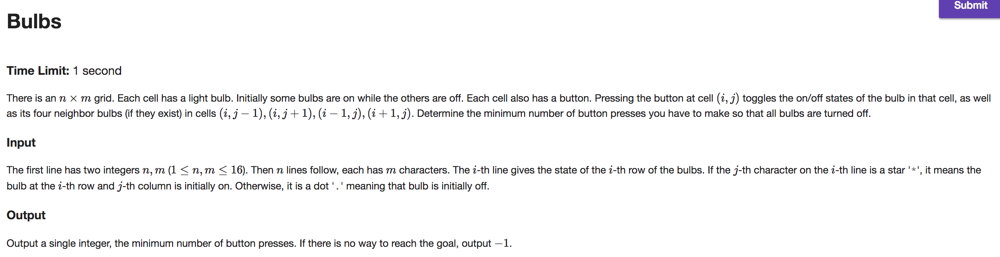
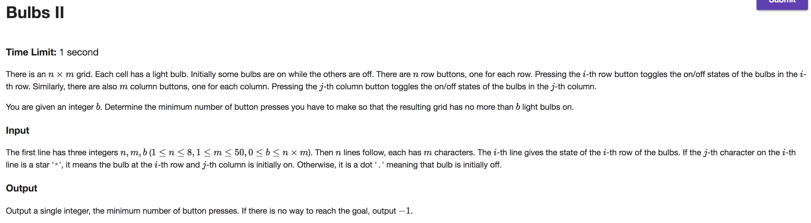
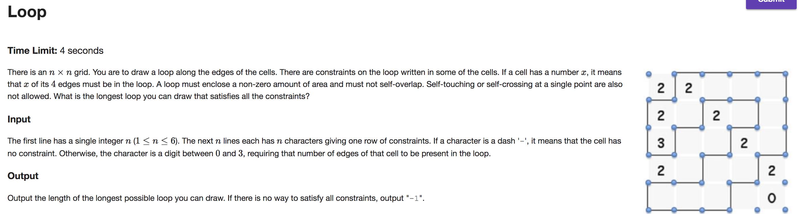

## A



```java
import java.io.BufferedReader;
import java.io.IOException;
import java.io.InputStreamReader;
import java.util.BitSet;

public class Main {

    public static void main(String[] args) throws IOException {
        BufferedReader br = new BufferedReader(new InputStreamReader(System.in));
        String line = br.readLine(); String[] tokens = line.split("\\s");
        final int ROWS = Integer.parseInt(tokens[0]); final int COLS = Integer.parseInt(tokens[1]);

        BitSet grid = new BitSet(ROWS * COLS);
        for (int row = 0; row < ROWS; row++) {
            line = br.readLine();
            for (int col = 0; col < COLS; col++) grid.set(col + (row * COLS), line.charAt(col) == '*');
        }

        int minToggles = Integer.MAX_VALUE;

        // from 'COLS' choose 0 for row zero
        BitSet testGrid = (BitSet) grid.clone(); int toggles = cascade(testGrid, ROWS, COLS);
        if (testGrid.isEmpty()) minToggles = toggles;

        for (int choose = 1; choose <= COLS; choose++) { // from 'COLS' choose 'choose' for row zero
            int combination = (1 << choose) - 1; // initial combination
            while (combination < (1 << COLS)) { // apply combination to row 0; cascade
                testGrid = (BitSet) grid.clone();
                int index = 0; toggles = 0;
                while (toggles < choose) {  // apply the combination
                    if (((combination >> index) & 1) == 1) {
                        toggle(testGrid, ROWS, COLS, index);
                        toggles++;
                    }
                    index++;
                }
                toggles += cascade(testGrid, ROWS, COLS); // cascade
                if (testGrid.isEmpty()) minToggles = Math.min(toggles, minToggles);

                combination = nextCombination(combination); // get next combination
            }
        }

        System.out.print(minToggles == Integer.MAX_VALUE ? -1 : minToggles);
    }

    private static void toggle(BitSet grid, int rows, int cols, int cell) {
        grid.flip(cell);
        int row = cell / cols; int col = cell - (row * cols);
        if (row - 1 >= 0) grid.flip(col + ((row - 1) * cols));
        if (row + 1 < rows) grid.flip(col + ((row + 1) * cols));
        if (col - 1 >= 0) grid.flip((col - 1) + (row * cols));
        if (col + 1 < cols) grid.flip((col + 1) + (row * cols));
    }

    // light chasing; I don't know why exactly this works...yet
    // https://en.wikipedia.org/wiki/Lights_Out_(game)#Light_chasing
    private static int cascade(BitSet testGrid, int rows, int cols) {
        if (testGrid.isEmpty()) return 0;
        int toggles = 0;
        for (int row = 1; row < rows; row++) {
            for (int col = 0; col < cols; col++) {
                if (testGrid.get(col + ((row - 1) * cols))) {
                    toggle(testGrid, rows, cols, col + (row * cols));
                    toggles++;
                }
            }
        }
        return  toggles;
    }

    private static int nextCombination(int x) {
        int u = x & -x;
        int v = u + x;
        return v + (((v ^ x) / u) >> 2);
    }
}


```

---

## B



```java
import java.io.BufferedReader;
import java.io.IOException;
import java.io.InputStreamReader;
import java.util.BitSet;
import java.util.Collections;
import java.util.PriorityQueue;

public class Main {

    private static int MIN_LIGHTS;
    private static int minToggles = Integer.MAX_VALUE;

    public static void main(String[] args) throws IOException {
        BufferedReader br = new BufferedReader(new InputStreamReader(System.in));
        String line = br.readLine(); String[] tokens = line.split("\\s");
        int ROWS = Integer.parseInt(tokens[0]); int COLS = Integer.parseInt(tokens[1]);
        MIN_LIGHTS = Integer.parseInt(tokens[2]);

        BitSet grid = new BitSet(ROWS * COLS);
        for (int row = 0; row < ROWS; row++) {
            line = br.readLine();
            for (int col = 0; col < COLS; col++) grid.set(col + (row * COLS), line.charAt(col) == '*');
        }

        BitSet testGrid = (BitSet) grid.clone();
        PriorityQueue<Integer> maxHeap = new PriorityQueue<Integer>(COLS, Collections.reverseOrder());

        // from 'ROWS' choose 0
        greedyColumns(testGrid, ROWS, COLS, maxHeap, 0);

        for (int choose = 1; choose <= ROWS; choose++) { // from 'ROWS' choose 'choose'
            int combination = (1 << choose) - 1; // initial combination
            while (combination < (1 << ROWS)) {
                testGrid = (BitSet) grid.clone();
                int index = 0; int toggles = 0;
                while (toggles < choose) {  // apply the combination
                    if (((combination >> index) & 1) == 1) {
                        testGrid.flip((index * COLS), (index * COLS) + COLS);
                        toggles++;
                    }
                    index++;
                }

                greedyColumns(testGrid, ROWS, COLS, maxHeap, toggles);
                combination = nextCombination(combination); // get next combination
            }
        }
        System.out.print(minToggles == Integer.MAX_VALUE ? -1 : minToggles);
    }

    private static void greedyColumns(BitSet testGrid, int ROWS, int COLS, PriorityQueue<Integer> maxHeap, int toggles) {
        maxHeap.clear();
        for (int col = 0; col < COLS; col++) { // gather up the columns
            int colLights = 0;
            for (int row = 0; row < ROWS; row++) if (testGrid.get(col + (row * COLS))) colLights++;
            maxHeap.add(colLights);
        }

        int lights = testGrid.cardinality();
        while (lights > MIN_LIGHTS && !maxHeap.isEmpty()) { // use the columns greedily
            int off = maxHeap.poll();
            if (off <= ROWS / 2) break; // point of diminishing returns
            int on = ROWS - off;
            lights -= off; lights += on;
            toggles++;
        }
        if (lights <= MIN_LIGHTS) minToggles = Math.min(toggles, minToggles);
    }

    private static int nextCombination(int x) {
        int u = x & -x;
        int v = u + x;
        return v + (((v ^ x) / u) >> 2);
    }
}


```

---

## C



```java
// Two optimizations and a hack make this work for when n == 6
// 1. Check if the current path can still form a valid loop whenever a bisection of the grid occurs.
// 2. Whenever the current path would intersect itself to form a lasso, check if that would actually be a valid loop.
// 3. Let every vertex try being the anchor from which we travel, but this is too slow, so exit before 4 seconds is up.

import java.io.BufferedReader;
import java.io.IOException;
import java.io.InputStreamReader;
import java.util.ArrayList;
import java.util.HashSet;

public class Main {

    private static int numNonZeroConstraints = 0;
    private static int maxLoop = -1;
    private static int N;
    private static HashSet<Vertex> visitedV;
    private static HashSet<Constraint> visitedC;
    private static boolean foundAnchor = false;
    private static long start;

    public static void main(String[] args) throws IOException {
        start = System.nanoTime();
        BufferedReader br = new BufferedReader(new InputStreamReader(System.in));
        String line = br.readLine(); N = Integer.parseInt(String.valueOf(line.charAt(0)));
        visitedV = new HashSet<Vertex>(N * N);
        visitedC = new HashSet<Constraint>(N * N);

        Vertex[][] vertices = new Vertex[N + 1][N + 1];

        int id = 0;
        for (int row = 0; row < N + 1; row ++) {
            for (int col = 0; col < N + 1; col++) {
                vertices[row][col] = new Vertex(id, row, col); id++;
                if (row > 0) makeNeighbors(vertices[row][col], vertices[row - 1][col]);
                if (col > 0) makeNeighbors(vertices[row][col], vertices[row][col - 1]);
            }
        }

        id = 0;
        for (int row = 0; row < N; row++) {
            line = br.readLine();
            for (int col = 0; col < N; col++) {
                char c = line.charAt(col);
                if (c == '-') continue;
                int value = Integer.parseInt(String.valueOf(c));
                if (value != 0) numNonZeroConstraints++;
                Constraint con = new Constraint(id, Integer.parseInt(String.valueOf(c))); id++;
                pairVertexWithConstraint(vertices[row][col], con);
                pairVertexWithConstraint(vertices[row + 1][col], con);
                pairVertexWithConstraint(vertices[row][col + 1], con);
                pairVertexWithConstraint(vertices[row + 1][col + 1], con);
            }
        }


        for (Vertex[] row : vertices) {
            for (Vertex v : row) {
                v.isExhausted = true;
                travel(v, 0, 0);
            }
        }

        System.out.print(maxLoop);
    }

    private static void travel(Vertex v, int length, int satisfiedConstraints) {
        if ((System.nanoTime() - start) / 1000000000d > 3.92) { // AAAAAHHHHHHHHHH!!!!!!
            System.out.print(maxLoop);
            System.exit(0);
        }
        if (v.isAnchor && satisfiedConstraints == numNonZeroConstraints) {
            maxLoop = Math.max(length, maxLoop); return;
        }
        if (length > 0) {
            if ((v.row == N || v.row == 0) && (v.previous.row == N || v.previous.row == 0)) {
                visitedV.clear(); visitedC.clear(); foundAnchor = false;
                canReachAnchorFrom(v);
                if (visitedC.size() + satisfiedConstraints < numNonZeroConstraints) return;
                if (!foundAnchor) return;
            }
            if ((v.col == N || v.col == 0) && (v.previous.col == N || v.previous.col == 0)) {
                visitedV.clear(); visitedC.clear(); foundAnchor = false;
                canReachAnchorFrom(v);
                if (visitedC.size() + satisfiedConstraints < numNonZeroConstraints) return;
                if (!foundAnchor) return;
            }
        }
        for (Vertex n : v.neighbors) {
            if (!n.isExhausted && n.isConnected && !n.equals(v.previous) && !n.isAnchor) {
                ArrayList<Constraint> cons = new ArrayList<Constraint>(2);
                boolean safe = true;
                for (Constraint c : v.constraints) {
                    if (c.vertices.contains(n)) {
                        if (c.value == 0) {
                            safe = false; break;
                        }
                        cons.add(c);
                    }
                }
                if (safe) {
                    int satisfied = 0;
                    for (Constraint c : cons) {
                        if (c.value == 1) {
                            if (!c.satisfied() || (c.satisfied() && c.vertices.contains(n.previous)))
                                satisfied++;
                            if (c.satisfied() && !c.vertices.contains(n.previous)) {
                                safe = false; break;
                            }
                        }
                        if (c.value == 2) {
                            if (c.used == 1 && !c.vertices.contains(n.previous))
                                satisfied++;
                            else {
                                safe = false;
                                break;
                            }
                        }
                        if (c.value == 3) {
                            safe = false;
                            break;
                        }
                    }

                    if (safe) {
                        int total = (v.satisfied - n.satisfied) + satisfied;
                        if (total == numNonZeroConstraints) {
                            maxLoop = Math.max((v.length - n.length) + 1, maxLoop);
                        }
                    }
                }
            }

            boolean canConnect = (!n.equals(v.previous)) && (n.isAnchor || (!n.isConnected && !n.isExhausted));
            if (canConnect) {
                ArrayList<Constraint> cons = new ArrayList<Constraint>(2);
                for (Constraint c : v.constraints) {
                    if (c.vertices.contains(n)) {
                        if (c.satisfied()) {
                            canConnect = false; break;
                        }
                        cons.add(c);
                    }
                }
                if (canConnect) {
                    v.isAnchor = length == 0;
                    v.isConnected = true;
                    n.previous = v;
                    n.length = v.length + 1;

                    int satisfied = 0;
                    for (Constraint c : cons) {
                        c.used++;
                        if (c.satisfied()) satisfied++;
                    }

                    n.satisfied = v.satisfied + satisfied;

                    travel(n, length + 1, satisfiedConstraints + satisfied);

                    for (Constraint c : cons) c.used--;
                    n.satisfied = 0;
                    n.length = 0;
                    n.previous = null;
                    v.isConnected = false;
                    v.isAnchor = false;
                }
            }
        }
    }

    private static void canReachAnchorFrom(Vertex v) {
        visitedV.add(v);
        for (Constraint c : v.constraints) if (c.value > 0 && !c.satisfied()) visitedC.add(c);
        for (Vertex n : v.neighbors) {
            if (n.isAnchor) foundAnchor = true;
            if (!n.isExhausted && !n.isConnected && !visitedV.contains(n)) canReachAnchorFrom(n);
        }
    }

    private static void pairVertexWithConstraint(Vertex v, Constraint c) {
        v.constraints.add(c); c.vertices.add(v);
    }

    private static void makeNeighbors(Vertex v1, Vertex v2) {
        v1.neighbors.add(v2); v2.neighbors.add(v1);
    }
}

class Constraint {
    private int id;
    int value;
    int used;
    HashSet<Vertex> vertices;
    Constraint(int id, int value) {
        this.id = id;
        this.value = value; used = 0;
        vertices = new HashSet<Vertex>(4);
    }

    boolean satisfied() { return value - used <= 0; }

    @Override
    public boolean equals(Object obj) {
        if (obj instanceof  Constraint) {
            Constraint that = (Constraint) obj;
            return this.id == that.id;
        }
        return false;
    }
}

class Vertex {
    private int id; int row, col; int satisfied, length;
    boolean isConnected, isAnchor, isExhausted;
    Vertex previous;
    ArrayList<Vertex> neighbors;
    ArrayList<Constraint> constraints;
    Vertex(int id, int row, int col) {
        this.id = id; this.row = row; this.col = col;
        neighbors = new ArrayList<Vertex>(4);
        constraints = new ArrayList<Constraint>(4);
    }

    @Override
    public boolean equals(Object obj) {
        if (obj instanceof  Vertex) {
            Vertex that = (Vertex) obj;
            return this.id == that.id;
        }
        return false;
    }
}


```
