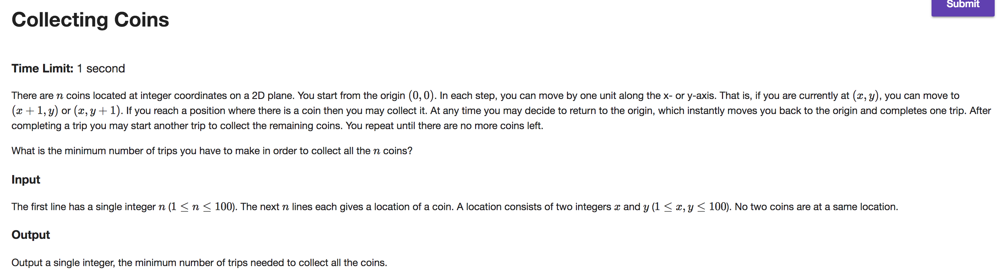
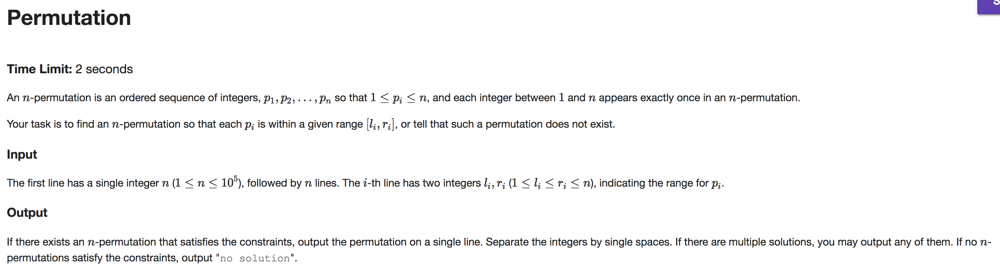
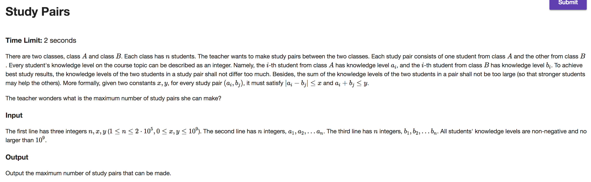

## A



```java
import java.io.BufferedReader;
import java.io.IOException;
import java.io.InputStreamReader;
import java.util.Arrays;
import java.util.Comparator;

public class Main {

    public static void main(String[] args) throws IOException {
        BufferedReader br = new BufferedReader(new InputStreamReader(System.in));
        int n = Integer.parseInt(br.readLine());
        Coin[] coins = new Coin[n];
        String[] tokens;
        int maxHeight = 0;
        for (int i = 0; i < n; i++) {
            tokens = br.readLine().split("\\s");
            maxHeight = Math.max(maxHeight, Integer.parseInt(tokens[1]));
            coins[i] = new Coin(Integer.parseInt(tokens[0]), Integer.parseInt(tokens[1]));
        }

        Arrays.sort(coins, Comparator.comparingInt(c -> c.x));

        int trips = 0;
        for (int height = 0; height <= maxHeight; height++) {
            int x = 0; int y = height;
            while (y <= maxHeight) {
                for (Coin c : coins) {
                    if (!c.collected && c.y == y && c.x >= x) {
                        x = c.x;
                        c.collected = true;
                        n--;
                    }
                }
                y++;
            }
            trips++;
            if (n == 0) break;
        }

        System.out.print(trips);
    }
}

class Coin {
    int x, y;
    boolean collected;

    Coin(int x, int y) {
        this.x = x; this.y = y;
        collected = false;
    }
}

```

---

## B



```java
import java.io.BufferedReader;
import java.io.IOException;
import java.io.InputStreamReader;
import java.util.ArrayList;
import java.util.Comparator;
import java.util.HashSet;

public class Main {

    public static void main(String[] args) throws IOException {
        BufferedReader br = new BufferedReader(new InputStreamReader(System.in));

        final int N = Integer.parseInt(br.readLine());

        Position[] positions = new Position[N + 1];
        for (int value = 1; value <= N; value++) {
            positions[value] = new Position(value);
        }

        ArrayList<Range> ranges = new ArrayList<>(N);
        String[] tokens;
        for (int index = 0; index < N; index++) {
            tokens = br.readLine().split("\\s");
            int left = Integer.parseInt(tokens[0]);
            int right = Integer.parseInt(tokens[1]);
            Range r = new Range(index, left, right);
            ranges.add(r);
        }

        ranges.sort(Comparator.comparingInt((Range r) -> r.right));

        int[] permutation = new int[N];
        HashSet<Integer> usedSet = new HashSet<>(N);
        for (Range r : ranges) {
            Position pos = findRoot(positions[r.left]);

            if (pos.value > r.right || usedSet.contains(pos.value)) {
                System.out.print("no solution");
                System.exit(0);
            }

            permutation[r.index] = pos.value;
            usedSet.add(pos.value);

            if (pos.value < positions.length - 1)
                union(pos, positions[pos.value + 1]);
        }

        StringBuilder out = new StringBuilder(N * 2);
        for (int num : permutation) out.append(num).append(" ");
        System.out.print(out);
    }

    private static Position findRoot(Position pos) {
        if (pos.parent == pos) return pos;
        return pos.parent = findRoot(pos.parent);
    }

    private static void union(Position pos1, Position pos2) {
        Position r1 = findRoot(pos1); Position r2 = findRoot(pos2);
        int value = Math.max(r1.value, r2.value);
        r1.value = value; r2.value = value;
        if (r1.rank > r2.rank)
            r2.parent = r1;
        else if (r2.rank > r1.rank)
            r1.parent = r2;
        else {
            r2.parent = r1;
            r1.rank++;
        }
    }
}

class Range {
    int index, left, right;

    Range(int index, int left, int right) {
        this.index = index;
        this.left = left;
        this.right = right;
    }
}

class Position {
    int value, rank;
    Position parent;

    Position(int value) {
        this.value = value;
        rank = 0;
        parent = this;
    }
}

```

---

## C



```java
import java.io.BufferedReader;
import java.io.IOException;
import java.io.InputStreamReader;
import java.util.Arrays;
import java.util.Comparator;
import java.util.HashMap;

public class Main {

    public static void main(String[] args) throws IOException {
        BufferedReader br = new BufferedReader(new InputStreamReader(System.in));
        String[] tokens = br.readLine().split("\\s");
        final int N = Integer.parseInt(tokens[0]);
        final int MAX_DIFF = Integer.parseInt(tokens[1]);
        final int MAX_SUM = Integer.parseInt(tokens[2]);

        Student[] classA = new Student[N];
        tokens = br.readLine().split("\\s");
        for (int i = 0; i < tokens.length; i++) {
            Student s = new Student(Integer.parseInt(tokens[i]));
            int upper = Math.min(MAX_SUM - s.level, s.level + MAX_DIFF);
            int lower = Math.max(s.level - MAX_DIFF, 0);
            if (upper < lower) {
                s.canPair = false;
            } else {
                s.upper = upper;
                s.lower = lower;
            }
            classA[i] = s;
        }
        Arrays.sort(classA, Comparator.comparingInt(s -> s.upper));

        HashMap<Integer, Integer> levels = new HashMap<>(N);
        tokens = br.readLine().split("\\s");
        for (String token : tokens) {
            int level = Integer.parseInt(token);
            if (levels.containsKey(level)) levels.put(level, levels.get(level) + 1);
            else levels.put(level, 1);
        }

        Student[] classB = new Student[levels.size()];
        int i = 0;
        for (int level : levels.keySet()) {
            Student s = new Student(level);
            s.instances = levels.get(level);
            classB[i] = s; i++;
        }
        Comparator<Student> levelComparator = Comparator.comparingInt(s -> s.level);
        Arrays.sort(classB, levelComparator);

        int pairs = 0;
        for (Student s1 : classA) {
            if (s1.canPair) {
                int index = Arrays.binarySearch(classB, new Student(s1.lower), levelComparator);
                if (index < 0) index = -index - 1;
                if (index < classB.length) {
                    Student s2 = findRoot(classB[index]);
                    if (s2.instances > 0 && s2.level >= s1.lower && s2.level <= s1.upper) {
                        s2.instances--;
                        if (s2.instances == 0) {
                            index = Arrays.binarySearch(classB, new Student(s2.level + 1), levelComparator);
                            if (index < 0) index = -index - 1;
                            if (index < classB.length) union(s2, findRoot(classB[index]));
                        }
                        pairs++;
                    }
                }
            }
        }

        System.out.print(pairs);
    }

    private static Student findRoot(Student s) {
        if (s.parent == s) return s;
        return s.parent = findRoot(s.parent);
    }

    private static void union(Student s1, Student s2) {
        Student r1 = findRoot(s1); Student r2 = findRoot(s2);
        int level = Math.max(r1.level, r2.level);
        int instances = Math.max(r1.instances, r2.instances);
        r1.level = level; r2.level = level;
        r1.instances = instances; r2.instances = instances;
        if (r1.rank > r2.rank)
            r2.parent = r1;
        else if (r2.rank > r1.rank)
            r1.parent = r2;
        else {
            r2.parent = r1;
            r1.rank++;
        }
    }
}

class Student {
    int level, lower, upper;
    boolean canPair;
    int rank, instances;
    Student parent;

    Student(int level) {
        this.level = level;
        canPair = true;
        rank = 0; parent = this;
    }
}

```
