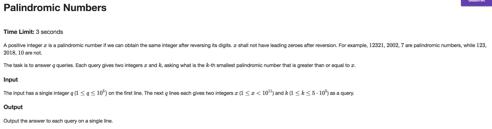

## A


```java
import java.util.Scanner;

public class Main {

    private static final int P = 1_000_000_007;
    private static final int K = 4;

    public static void main(String[] args) {
	    int[] V = new int[] {1, 1, 2, 7};

	    int[][] M = new int[][] {
                {0, 1, 0, 0},
                {0, 0, 1, 0},
                {0, 0, 0, 1},
                {2, 4, 1, 1}
        };

        long pow = new Scanner(System.in).nextLong() - 1;

        if (pow >= 1) {
            int[][] T = powMatrix(M, pow);

            int res = 0;
            for (int i = 0; i < K; i++) res = modAdd(res, modMult(T[1][i], V[i]));

            System.out.print(res);
        } else System.out.print(1);
    }

    private static int modAdd(int a, int b) {
        return (int) (((long)a + b) % P);
    }

    private static int modMult(int a, int b) {
        return (int) (((long)a * b) % P);
    }

    // methods below based on code from...
    // http://fusharblog.com/solving-linear-recurrence-for-programming-contest/

    private static int[][] multMatrices(int[][] a, int[][] b) {
        int[][] c = new int[K][K];
        for (int i = 0; i < K; i++)
            for (int j = 0; j < K; j++)
                for (int k = 0; k < K; k++)
                    c[i][j] = modAdd(c[i][j], modMult(a[i][k], b[k][j]));
        return c;
    }

    private static int[][] powMatrix(int[][] a, long pow) {
        if (pow == 1)
            return a;
        if (pow % 2 == 1)
            return multMatrices(a, powMatrix(a, pow - 1));
        int[][] m = powMatrix(a, pow / 2);
        return multMatrices(m, m);
    }
}

```

---

## B


```java
import java.io.BufferedReader;
import java.io.IOException;
import java.io.InputStreamReader;

public class Main {

    private static int[][] cars;

    public static void main(String[] args) throws IOException {
        BufferedReader br = new BufferedReader(new InputStreamReader(System.in));
        int n = Integer.parseInt(br.readLine());

        cars = new int[n][2]; String[] tokens;
        for (int i = 0; i < n; i++) {
            tokens = br.readLine().split("\\s");
            cars[i] = new int[] {Integer.parseInt(tokens[0]), Integer.parseInt(tokens[1])};
        }

        System.out.printf("%.6f", minTernarySearch());
    }

    private static double distance(double time) {
        double l = Integer.MAX_VALUE, r = Integer.MIN_VALUE;
        for (int[] car : cars) {
            double x = car[0] + (car[1] * time);
            l = Math.min(l, x); r = Math.max(r, x);
        }
        return Math.abs(r - l);
    }

    private static double minTernarySearch() {
        double minTime = 0, maxTime = 100_000;
        while (minTime + 1e-6 < maxTime) {
            double lowerTime = minTime + (maxTime - minTime) / 3;
            double upperTime = maxTime - (maxTime - minTime) / 3;
            if (distance(lowerTime) > distance(upperTime)) minTime = lowerTime;
            else maxTime = upperTime;
        }
        return distance((minTime + maxTime) / 2);
    }
}

```

---

## C



```java
import java.io.BufferedReader;
import java.io.IOException;
import java.io.InputStreamReader;
import java.util.HashSet;

public class Main {

    private static final long UPPER_BOUND = 1_000_000_000_000L;
    private static HashSet<Long> powersOfTen;

    public static void main(String[] args) throws IOException {
        powersOfTen = new HashSet<>(12);
        long powerOfTen = 1;
        while (powerOfTen < UPPER_BOUND) {
            powerOfTen *= 10;
            powersOfTen.add(powerOfTen);
        }

        BufferedReader br = new BufferedReader(new InputStreamReader(System.in));
        int queries = Integer.parseInt(br.readLine());

        String[] tokens;
        StringBuilder out = new StringBuilder();
        while (queries-- > 0) {
            tokens = br.readLine().split("\\s");
            long x = Long.parseLong(tokens[0]), k = Long.parseLong(tokens[1]);
            long numPalX = numPal(x - 1);

            long l = x, r = UPPER_BOUND;
            long m;
            while (true) {
                m = (l + r) / 2;
                long pals = numPal(m) - numPalX;
                if (pals == k) break;
                if (pals > k) r = m - 1;
                else l = m + 1;
            }
            out.append(getFirstPalLessThanOrEqualTo(m)).append("\n");
        }

        System.out.print(out);
    }

    private static long getFirstPalLessThanOrEqualTo(long x) {
        if (powersOfTen.contains(x)) return x - 1;
        String digitsString = String.valueOf(x);
        boolean isEvenDigits = digitsString.length() % 2 == 0;
        long prefix = getPrefix(digitsString, isEvenDigits);
        long pal = makePal(prefix, isEvenDigits);
        return pal <= x ? pal : makePal(prefix - 1, isEvenDigits);
    }

    private static long getPrefix(String x, boolean isEvenDigits) {
        int halfLen = x.length() / 2;
        String prefixString = x.substring(0, isEvenDigits ? halfLen : halfLen + 1);
        return Long.parseLong(prefixString);
    }

    // this method is based on the math described here...
    // https://codereview.stackexchange.com/a/146424
    private static long numPal(long x) {
        String digitsString = String.valueOf(x);
        boolean isEvenDigits = digitsString.length() % 2 == 0;

        long prefix = getPrefix(digitsString, isEvenDigits);
        long prefixLen = String.valueOf(prefix).length();

        if (makePal(prefix, isEvenDigits) > x) prefix--;

        if (isEvenDigits)
            return (prefix * 2) + ((long)Math.pow(10, prefixLen)) - prefix - 1;
        else
            return (prefix * 2) - prefix + ((long)Math.pow(10, prefixLen - 1)) - 1;
    }

    private static long makePal(long prefix, boolean isEvenLen) {
        String prefixString = String.valueOf(prefix);
        String postfixString = prefixString.substring(0, isEvenLen ? prefixString.length() : prefixString.length() - 1);
        StringBuilder pal = new StringBuilder().append(postfixString).reverse();
        pal.insert(0, prefix);
        return Long.parseLong(pal.toString());
    }
}

```

---

## D


```java
import java.io.BufferedReader;
import java.io.IOException;
import java.io.InputStreamReader;
import java.util.ArrayList;

public class Main {

    private static ArrayList<Integer> conVotes;
    private static int proVotes;

    public static void main(String[] args) throws IOException {
        BufferedReader br = new BufferedReader(new InputStreamReader(System.in));
        br.readLine(); // skip this line

        String[] tokens = br.readLine().split("\\s");
        proVotes = Integer.parseInt(tokens[0]);

        conVotes = new ArrayList<>(tokens.length - 1);
        for (int i = 1; i < tokens.length; i++) {
            int v = Integer.parseInt(tokens[i]);
            if (v >= proVotes) conVotes.add(v);
        }

        int low = 0, high = 1_000_000_000;

        while (low < high) {
            int mid = (low + high) / 2;
            if (clientWinsElection(mid)) high = mid;
            else low = mid + 1;
        }

        System.out.print(low);
    }

    private static boolean clientWinsElection(int persuasions) {
        int newProVotes = proVotes + persuasions;
        for (Integer v : conVotes) {
            if (v >= newProVotes) {
                int reduction = (v - newProVotes) + 1;
                if (reduction > persuasions) return false;
                persuasions -= reduction;
            }
        }
        return true;
    }
}

```
