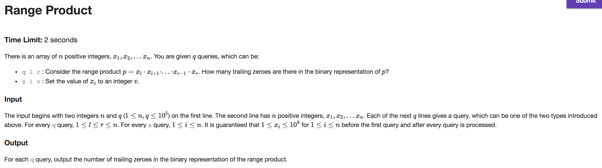

## A


```java
import java.io.BufferedReader;
import java.io.IOException;
import java.io.InputStreamReader;

public class Main {

    public static void main(String[] args) throws IOException {
        BufferedReader br = new BufferedReader(new InputStreamReader(System.in));
        String[] tokens = br.readLine().split("\\s");
        final int N = Integer.parseInt(tokens[0]); final int K = Integer.parseInt(tokens[1]);
        String[] columns = br.readLine().split("\\s");

        int[] delta = new int[N];
        int prefixSum = 0; long shots = 0;

        for (int i = 0; i < N; i++) {
            prefixSum += delta[i];
            int height = Integer.parseInt(columns[i]) - prefixSum;
            if (height > 0) {
                shots += height;
                prefixSum += height;
                int rangeEnd = i + K;
                if (rangeEnd < N) delta[rangeEnd] += -height;
            }
        }

        System.out.print(shots);
    }
}

```

---

## B



```java
import java.io.BufferedReader;
import java.io.IOException;
import java.io.InputStreamReader;

public class Main {

    private static final double log2 = Math.log(2);

    public static void main(String[] args) throws IOException {
        BufferedReader br = new BufferedReader(new InputStreamReader(System.in));
        String[] tokens = br.readLine().split("\\s");
        int q = Integer.parseInt(tokens[1]);
        tokens = br.readLine().split("\\s");

        int[] data = new int[tokens.length];
        for (int i = 0; i < tokens.length; i++)
            data[i] = trailingZeros(Integer.parseInt(tokens[i]));

        SegTree segTree = new SegTree(data);
        StringBuilder out = new StringBuilder();
        while (q-- > 0) {
            tokens = br.readLine().split("\\s");
            char command = tokens[0].charAt(0);
            switch (command) {
                case 'q':
                    int l = Integer.parseInt(tokens[1]);
                    int r = Integer.parseInt(tokens[2]);
                    out.append(segTree.rsq(l, r)).append("\n");
                    break;
                case 's':
                    int i = Integer.parseInt(tokens[1]);
                    int diff = trailingZeros(Integer.parseInt(tokens[2])) - segTree.rsq(i, i);
                    segTree.add(i, diff);
                    break;
            }
        }

        System.out.print(out);
    }

    private static int trailingZeros(int x) {
        return (int) (Math.log(x & -x) / log2);
    }
}

class SegTree {
    private int[] tree;
    private int N;
    private int left(int p) { return p << 1;}
    private int right(int p) { return (p << 1) + 1;}

    private void build(int p, int L, int R, int[] data) {
        if (L == R) tree[p] = data[L];
        else {
            build(left(p), L, (L+R) / 2, data);
            build(right(p), (L+R) / 2 + 1, R, data);
            tree[p] = tree[left(p)] + tree[right(p)];
        }
    }

    private int rsq(int p, int L, int R, int i, int j) {
        if (i > R || j < L) return -1;
        if (L >= i && R <= j) return tree[p];
        int q1 = rsq(left(p) , L , (L+R) / 2, i, j);
        int q2 = rsq(right(p), (L+R) / 2 + 1, R , i, j);
        if (q1 == -1) return q2;
        if (q2 == -1) return q1;
        return q1 + q2;
    }

    private void add(int p, int L, int R, int i, int v) {
        if (i > R || i < L) return;
        if (L == R && L == i) tree[p] += v;
        else {
            add(left(p) , L , (L+R) / 2, i, v);
            add(right(p), (L+R) / 2 + 1, R , i, v);
            tree[p] = tree[left(p)] + tree[right(p)];
        }
    }

    int rsq(int i, int j) { return rsq(1, 0, N - 1, i - 1, j - 1); }
    void add(int i, int v) { add(1, 0, N - 1, i - 1, v);}

    SegTree(int[] data) {
        N = data.length;
        tree = new int[4 * N];
        build(1, 0, N - 1, data);
    }
}

```

---

## C


```java
import java.io.BufferedReader;
import java.io.IOException;
import java.io.InputStreamReader;
import java.util.ArrayList;

public class Main {

    public static void main(String[] args) throws IOException {
        BufferedReader br = new BufferedReader(new InputStreamReader(System.in));
        int n = Integer.parseInt(br.readLine());
        Node[] ramps = new Node[n + 1]; // neglect index 0
        String[] tokens;
        while (n-- > 1) {
            tokens = br.readLine().split("\\s");
            int r1 = Integer.parseInt(tokens[0]);
            int r2 = Integer.parseInt(tokens[1]);
            int distance = Integer.parseInt(tokens[2]);
            if (ramps[r1] == null) ramps[r1] = new Node();
            if (ramps[r2] == null) ramps[r2] = new Node();
            ramps[r1].children.add(new Child(ramps[r2], distance));
            ramps[r2].children.add(new Child(ramps[r1], distance));
        }

        SegTree segTree = new SegTree(dfsPreProcess(ramps[1]));

        int q = Integer.parseInt(br.readLine()); StringBuilder out = new StringBuilder();
        while (q-- > 0) {
            tokens = br.readLine().split("\\s");
            int r1 = Integer.parseInt(tokens[0]);
            int r2 = Integer.parseInt(tokens[1]);
            int l = Math.min(ramps[r1].pos, ramps[r2].pos);
            int r = Math.max(ramps[r1].pos, ramps[r2].pos);
            Node lca = segTree.rmq(l, r);
            int distance = (ramps[r1].distanceFromRoot + ramps[r2].distanceFromRoot) - (2 * lca.distanceFromRoot);
            out.append(distance).append("\n");
        }

        System.out.print(out);
    }

    private static Node[] dfsPreProcess(Node n) {
        ArrayList<Node> seq = new ArrayList<Node>();
        dfs(n, 0, seq);
        Node[] nodes = new Node[seq.size()];
        for (int i = 0; i < nodes.length; i++) nodes[i] = seq.get(i);
        return nodes;
    }

    private static void dfs(Node n, int depth, ArrayList<Node> seq) {
        n.visited = true;
        n.pos = seq.size() + 1; seq.add(n);
        n.depth = depth;
        for (Child c : n.children) {
            if (!c.node.visited) {
                c.node.distanceFromRoot = c.distance + n.distanceFromRoot;
                dfs(c.node, depth + 1, seq);
                seq.add(n);
            }
        }
    }
}

class SegTree {
    private Node[] tree;
    private Node[] data;
    private int N;
    private int left(int p) { return p << 1;}
    private int right(int p) { return (p << 1) + 1;}

    private void build(int p, int L, int R) {
        if (L == R) tree[p] = data[L];
        else {
            build(left(p), L, (L+R) / 2);
            build(right(p), (L+R) / 2 + 1, R);
            tree[p] = tree[left(p)].depth <= tree[right(p)].depth ? tree[left(p)] : tree[right(p)];
        }
    }

    private Node rmq(int p, int L, int R, int i, int j) {
        if (i > R || j < L) return null;
        if (L >= i && R <= j) return tree[p];
        Node n1 = rmq(left(p) , L , (L+R) / 2, i, j);
        Node n2 = rmq(right(p), (L+R) / 2 + 1, R , i, j);
        if (n1 == null) return n2;
        if (n2 == null) return n1;
        return n1.depth <= n2.depth ? n1 : n2;
    }

    Node rmq(int i, int j) { return rmq(1, 0, N - 1, i - 1, j - 1); }

    SegTree(Node[] data) {
        this.data = data;
        N = data.length;
        tree = new Node[4 * N];
        build(1, 0, N - 1);
    }
}

class Node {
    int depth; int pos;
    int distanceFromRoot;
    boolean visited;
    ArrayList<Child> children;
    Node() {
        depth = pos = distanceFromRoot = 0;
        visited = false;
        children = new ArrayList<Child>();
    }
}

class Child {
    int distance;
    Node node;

    Child(Node node, int distance) {
        this.node = node;
        this.distance = distance;
    }
}

```

---

## D


```java
import java.io.BufferedReader;
import java.io.IOException;
import java.io.InputStreamReader;
import java.util.ArrayList;

public class Main {

    public static void main(String[] args) throws IOException {
        BufferedReader br = new BufferedReader(new InputStreamReader(System.in));
        Integer q = Integer.parseInt(br.readLine());

        int[] data = new int[q]; int dataSize = 0;
        ArrayList<String[]> queries = new ArrayList<>();

        String[] tokens;
        while (q-- > 0) {
            tokens = br.readLine().split("\\s");
            char command = tokens[0].charAt(0);
            switch (command) {
                case 'a':
                    int x = Integer.parseInt(tokens[1]);
                    data[dataSize] = x; dataSize++;
                    break;
                default:
                    queries.add(tokens);
                    break;
            }
        }

        FenTree fenTree = new FenTree(dataSize + 1);
        for (int i = 1; i < dataSize; i++) fenTree.add(i, 1);

        StringBuilder out = new StringBuilder();
        for (String[] query : queries) {
            char command = query[0].charAt(0);
            int x = Integer.parseInt(query[1]);
            int l = 0; int r = dataSize - 1;
            switch (command) {
                case 'p': // print
                    while (true) {
                        int mid = (l + r) / 2;
                        double index = fenTree.get(mid);
                        if (index == x) {
                            out.append(data[mid]).append("\n");
                            break;
                        }
                        if (index > x) r = mid - 1;
                        else l = mid + 1;
                    }
                    break;
                default: // 'd' delete
                    while (true) {
                        int mid = (l + r) / 2;
                        double index = fenTree.get(mid);
                        if (index == x) {
                            fenTree.add(mid, -0.5);
                            if (mid < dataSize - 1) fenTree.add(mid + 1, -0.5);
                            break;
                        }
                        if (index > x) r = mid - 1;
                        else l = mid + 1;
                    }
                    break;
            }
        }
        System.out.print(out);
    }
}

class FenTree {
    private double[] tree;
    private final int size;

    FenTree(int size) {
        this.size = size;
        tree = new double[size];
    }

    void add(int k, double v) {
        k++;
        for (; k < size; k += -k&k) tree[k] += v;
    }

    double get(int k) {
        if (k < 0) return 0;
        k++;
        double ans = 0;
        for (; k > 0; k -= -k&k) ans += tree[k];
        return ans;
    }
}

```

---

## E


```java
import java.io.BufferedReader;
import java.io.IOException;
import java.io.InputStreamReader;
import java.util.HashMap;

public class Main {

    public static void main(String[] args) throws IOException {
        BufferedReader br = new BufferedReader(new InputStreamReader(System.in));
        br.readLine();
        String[] tokens = br.readLine().split("\\s");
        int[] data = new int[tokens.length];
        HashMap<Integer, Integer> map = new HashMap<>(tokens.length);
        for (int i = 0; i < tokens.length; i++) {
            data[i] = Integer.MAX_VALUE;
            int balloon = Integer.parseInt(tokens[i]);
            if (map.containsKey(balloon)) data[map.get(balloon)] = i;
            map.put(balloon, i);
        }

        SegTree segTree = new SegTree(data);

        StringBuilder out = new StringBuilder();
        int q = Integer.parseInt(br.readLine());
        while (q-- > 0) {
            tokens = br.readLine().split("\\s");
            int l = Integer.parseInt(tokens[0]);
            int r = Integer.parseInt(tokens[1]);
            out.append(segTree.ruq(l, r)).append("\n");
        }

        System.out.print(out);
    }
}

class SegTree {
    private int[][] tree;
    private int N;
    private int left(int p) { return p << 1;}
    private int right(int p) { return (p << 1) + 1;}

    private int[] merge(int[] a, int[] b) {
        int[] c = new int[a.length + b.length];
        int aHead = 0, bHead = 0, cHead = 0;
        while (aHead < a.length || bHead < b.length) {
            if (aHead < a.length && bHead < b.length) {
                if (a[aHead] < b[bHead]) {
                    c[cHead] = a[aHead];
                    aHead++;
                } else {
                    c[cHead] = b[bHead];
                    bHead++;
                }
            } else if (aHead < a.length) {
                c[cHead] = a[aHead];
                aHead++;
            } else {
                c[cHead] = b[bHead];
                bHead++;
            }
            cHead++;
        }
        return c;
    }

    private int uniqueness(int[] seg, int j) {
        int l = 0; int r = seg.length - 1;
        while (l < r) {
            int mid = (l + r) / 2;
            if (seg[mid] > j) r = mid - 1;
            else l = mid + 1;
        }
        return seg.length - (seg[l] <= j ? l + 1 : l);
    }

    private void build(int p, int L, int R, int[] data) {
        if (L == R) tree[p] = new int[] {data[L]};
        else {
            build(left(p), L, (L+R) / 2, data);
            build(right(p), (L+R) / 2 + 1, R, data);
            tree[p] = merge(tree[left(p)], tree[right(p)]);
        }
    }

    private int ruq(int p, int L, int R, int i, int j) {
        if (i > R || j < L) return 0;
        if (L >= i && R <= j) return uniqueness(tree[p], j);
        int q1 = ruq(left(p) , L , (L+R) / 2, i, j);
        int q2 = ruq(right(p), (L+R) / 2 + 1, R , i, j);
        return q1 + q2;
    }

    int ruq(int i, int j) {
        i = i - 1; j = j - 1;
        return ruq(1, 0, N - 1, i, j);
    }

    SegTree(int[] data) {
        N = data.length;
        tree = new int[4 * N][];
        build(1, 0, N - 1, data);
    }
}

```
